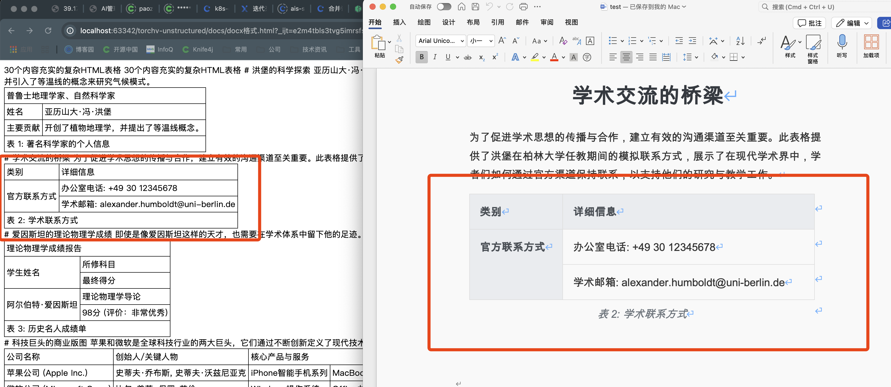
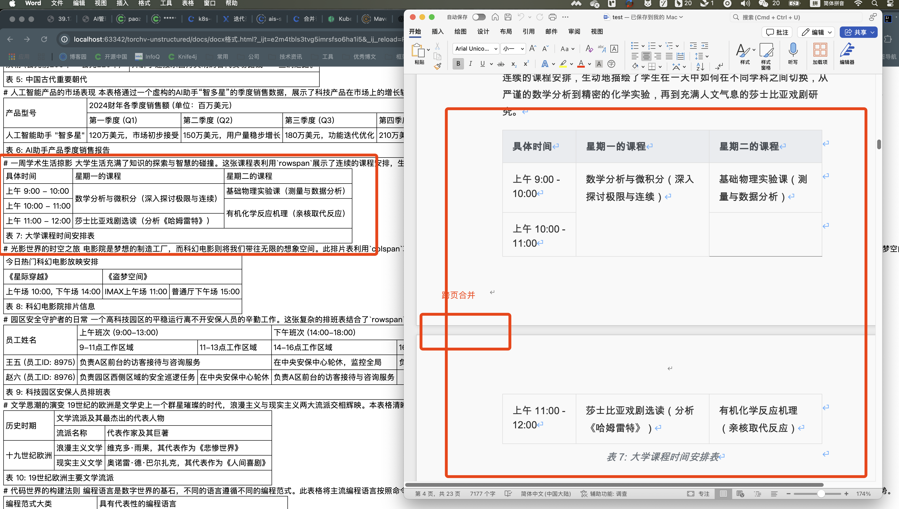
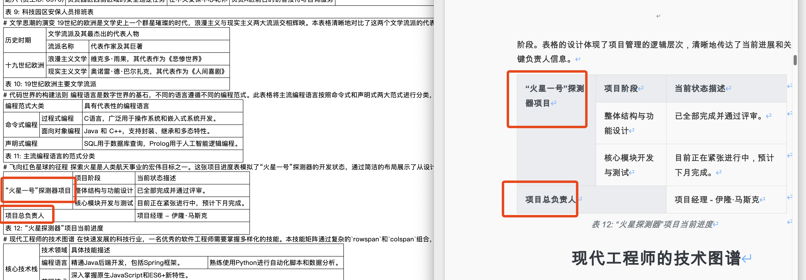
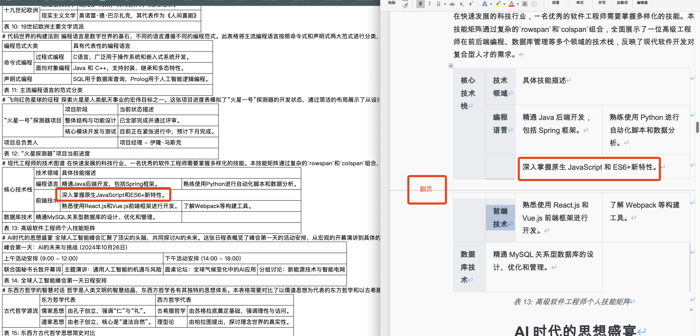
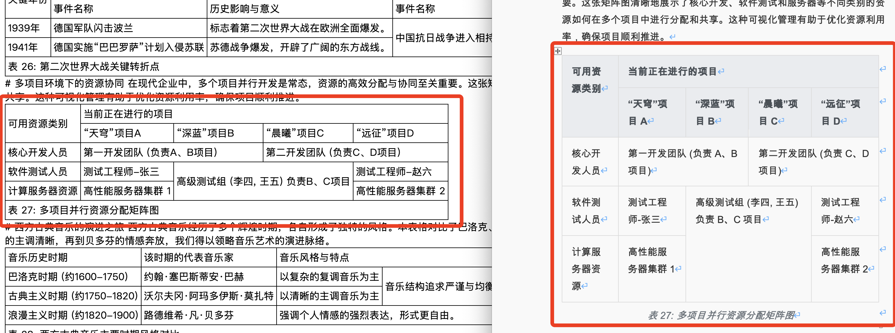

# Changelog

All notable changes to this project will be documented in this file.

The format is based on [Keep a Changelog](https://keepachangelog.com/en/1.0.0/),
and this project adheres to [Semantic Versioning](https://semver.org/spec/v2.0.0.html).

## [1.0.0] - 2025-07-21

### 🎉 初始发布

`torchv-unstructured` v1.0.0 发布。`torchv-unstructured` 依托目前Java平台的开源中间件,站在巨人的肩膀上，致力于深入文件格式内部，解决最棘手的解析与优化挑战，而不仅仅是表面内容提取。专注于为RAG（检索增强生成）等AI应用提供高质量、结构化的数据源。

本版本聚焦于解决一个典型痛点：Word文档（`.doc`和`.docx`）的解析。传统工具在处理这两种格式，尤其是包含复杂合并单元格（`rowspan`/`colspan`）的表格时，往往表现不佳，导致结构破坏和信息丢失。通过实现一套**完全基于表格结构、无需硬编码的通用算法**，能够精准解析`.doc`和`.docx`格式中的任意复杂表格。通过对不同格式采用差异化的最优处理策略，确保了转换后的内容（特别是HTML表格）与源文件在视觉和结构上高度一致，为下游的AI/ML管道提供了前所未有的高质量、结构化的数据。

### Maven坐标

```xml
<dependency>
    <groupId>com.torchv.infra</groupId>
    <artifactId>torchv-unstructured</artifactId>
    <version>1.0.0</version>
</dependency>
```

### ✨ 核心特性

#### 🔥 智能Word文档解析优化

- **全格式支持**：完整支持DOC和DOCX格式文档解析。
- **统一API设计**：通过 `UnstructuredParser` 提供简洁统一的解析入口。
- **高质量内容提取**：基于 Apache Tika、Apache POI 的可靠底层实现。
- **表格解析技术**：提供在Doc/Docx两种格式下的表格解析优化，解决单元格合并等问题

#### 🎯 RAG应用优化

- **Markdown输出**：专为向量化和检索优化的结构化内容。
- **表格结构保持**：HTML格式表格确保表格关系完整性，提升上下文理解。
- **灵活输出格式**：支持纯Markdown、带HTML表格的Markdown等多种格式。
- **元数据提取**：可提取丰富的文档元数据信息。

### 🔧 API设计

#### 简单易用的静态API

```java
// 解析为Markdown格式（推荐用于RAG）
String content = UnstructuredParser.toMarkdown("document.docx");

// 解析为带HTML表格的Markdown格式
String contentWithTables = UnstructuredParser.toMarkdownWithHtmlTables("document.docx");

// 仅提取表格数据
List<String> tables = UnstructuredParser.extractTables("document.docx");

// 获取完整解析结果
DocumentResult result = UnstructuredParser.toStructuredResult("document.docx");
```

#### 高级配置API

```java
// 使用RAG优化配置
try (WordParser parser = WordParser.ragOptimized()) {
    DocumentResult result = parser.parse("document.docx");
}

// 自定义配置
try (WordParser parser = WordParser.builder()
        .withTableExtraction(true)
        .withTableAsHtml(true)
        .withImageExtraction(false)
        .build()) {
    DocumentResult result = parser.parse("document.docx");
}
```

### 🔍 Word格式解析优势

本版本特别强化了Word格式文档的解析能力：

#### DOCX格式优化

- 基于Apache POI的OOXML标准解析。
- 完整的表格结构保持，包括复杂合并单元格。
- 精确的样式和格式信息提取。
- 支持嵌入对象和图像提取。

#### DOC格式增强

- 专门的HWPFDocument处理流程。
- 特殊的合并单元格检测算法，提升老旧文档兼容性。
- 兼容老版本Word文档格式。
- 强大的错误处理机制。

#### 表格解析突破

- 智能识别复杂表格结构。
- 准确计算`colspan`和`rowspan`。
- 保持表格语义完整性。
- 生成标准、干净的HTML表格输出。


### 🌹 解析效果验证

在31种不同格式的复杂表格类型进行了初步验证，包括上下单元格合并、跨页表格、左右单元格合并等多种复杂的情况，验证了doc/docx两种格式。主要表现如下：

- ✅ 完美识别`rowspan`和`colspan`合并单元格
- ✅ 准确保留所有表格内容，无丢失现象
- ✅ 正确处理跨页表格和复杂嵌套结构
- ✅ 支持任意语言和字符集的表格内容
- ✅ 在.doc和.docx格式上表现一致(目前doc格式无法提取markdown的header标题)
- ✅ 正确提取图片以及图片位置正确

在31个复杂表格情况下，对于表格的合并情况：

- ✅ 数据无错误,表格内容没错误的情况比例:30/31=96.8%

  > 包含数据完全正确，目前出现6个表格会出现数据没异常的情况，但是表格在纵向合并的情况并没有表现一致的情况

- ✅ 数据解析异常，错误比率：1/31=3.23%

  > 在31个复杂表格数据的情况下，出现了解析还原错误的情况，表格数据错位了的情况，这种情况在做知识库场景下送给大模型时，会导致数据异常、回答幻觉的情况发生

- ✅ 表格完全正确，colspan/rowspan完全无错误的情况：25/31=80.6%

  > 数据完全一致、表格完全一致，100%还原出来的比例。

1、简单的上下合并情况



2、跨页上下单元格合并单元格的情况



3、上下左右单元格合并的情况



4、翻页单元格上下左右合并的情况



5、更复杂的纵向横向表格合并情况



## 

### 🔮 未来规划

v1.0.0作为稳定的基础版本，后续版本将在此基础上扩展：

- 支持更多文档格式（PDF、PPT、Excel等）。
- 增强图像和媒体内容处理。
- 提供云原生部署支持。
- 扩展AI集成能力。

---

**感谢您选择TorchV Unstructured！**

如果您有任何问题或建议，请通过以下方式联系我们：

- 📧 邮箱：<xiaoymin@foxmail.com>
- 🐛 问题反馈：[GitHub Issues](https://github.com/torchv/torchv-unstructured/issues)
- 💬 技术讨论：[GitHub Discussions](https://github.com/torchv/torchv-unstructured/discussions)

---
由 [TorchV团队](https://www.torchv.com/) 用 ❤️ 制作
